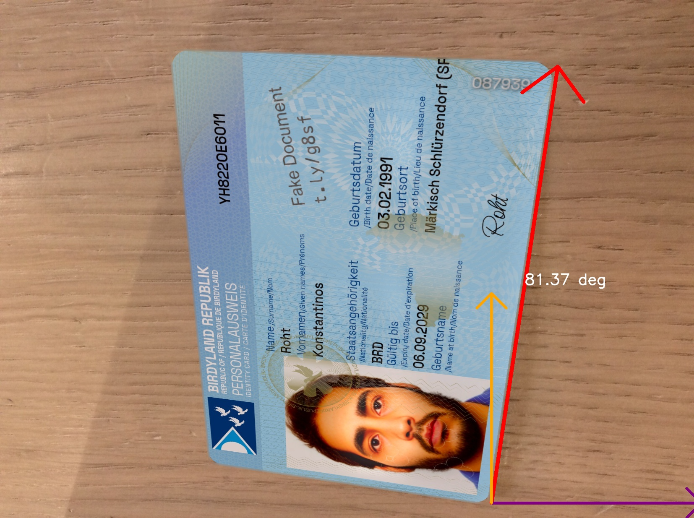
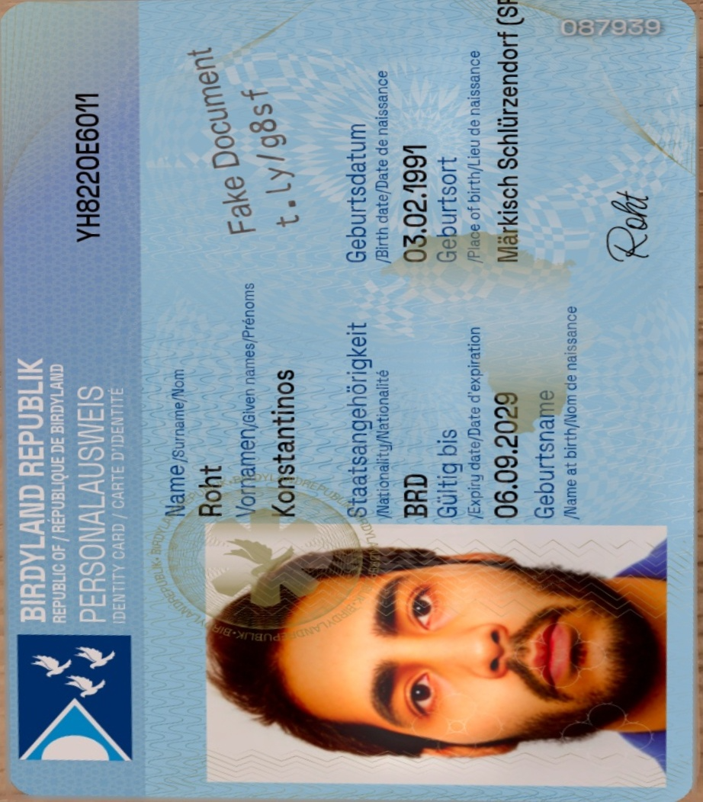
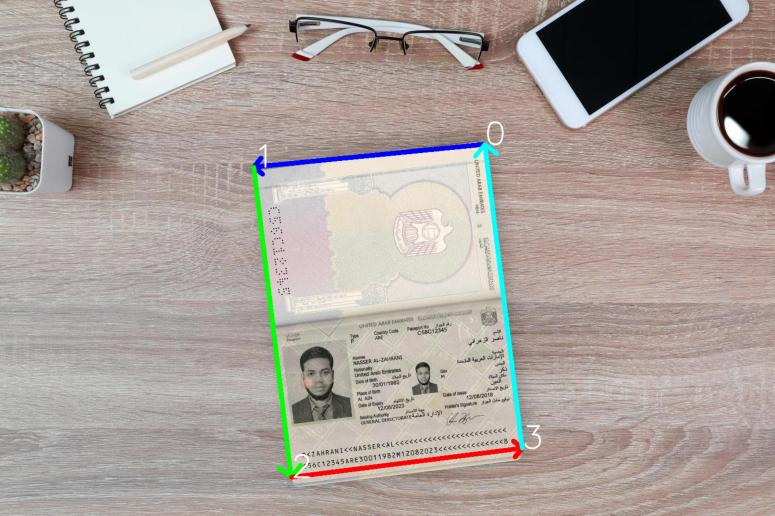
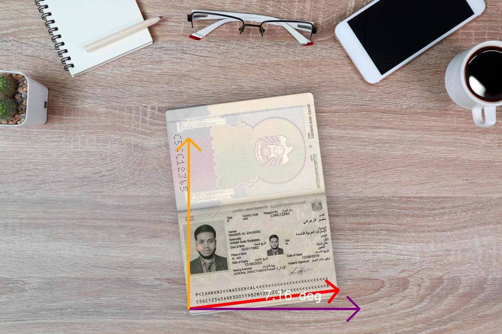
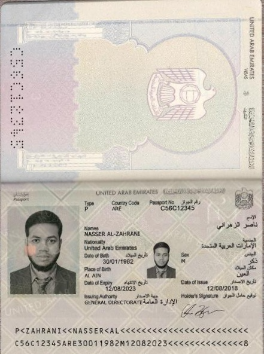
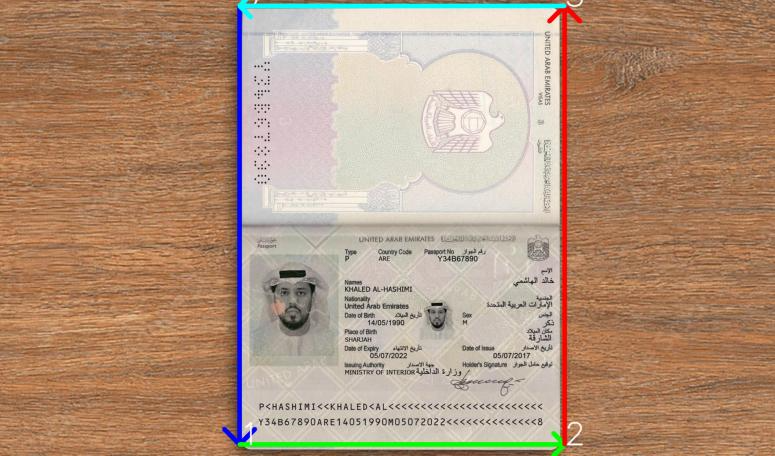
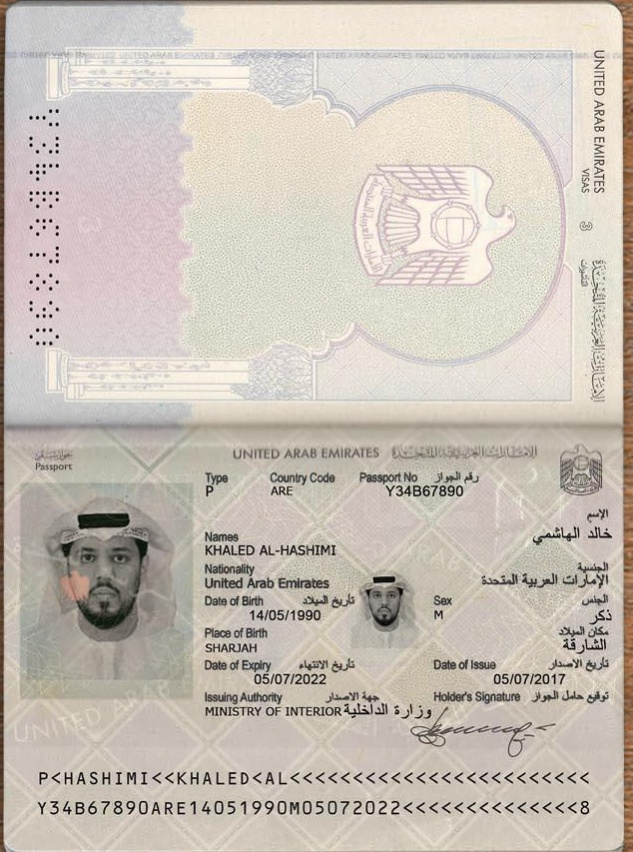

# AI ID-Card Smart Scanner
## Steps to run Inference:

### Step-1 : 

cd AI_ID_Card_Smart_Scanner

### Step-2 : Create the virtual environment using poetry using below command 

poetry install

or create virtual environment using conda for python 3.13.5 and run 

pip install -r requirements.txt

### Step-3 : Run inference

python src/inference.py ./sample_input_imgs/test_img_1.jpg

(the output images will be saved in output folder)

### Step-4 : To test FastAPI

#### Start the FastAPI server

uvicorn app:app --reload --port 8001

#### Test by sending request to the API

curl -X POST http://127.0.0.1:8001/process/   -F image=@./sample_input_imgs/test_img_1.jpg

## To Train/Finetune the Yolo11n-seg model :

### Step-1 : 
Use below script to Convert DocXPan_25k Dataset's Localization Labels to YOLO polygon segmentation format
extra_scripts/DocXPand_25k_to_YOLO_Format.ipynb

### Step-2
Training script is provided as .ipynb file i.e., extra_scripts/yolo_polygon_seg_training.ipynb

## Results

### ID Card Segmentation

### Landscape Images

| ordered edges | angle visualization | final scanned image |
|:---:|:---:|:---:|
|  |  |  |
|  |  |  |

### Portrait Images

| ordered edges | angle visualization | final scanned image |
|:---:|:---:|:---:|
|  |  |  |
|  |  |  |
