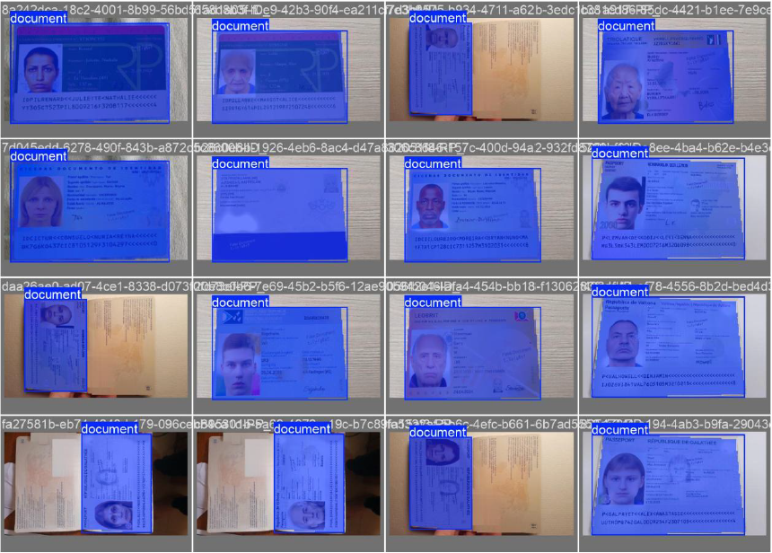
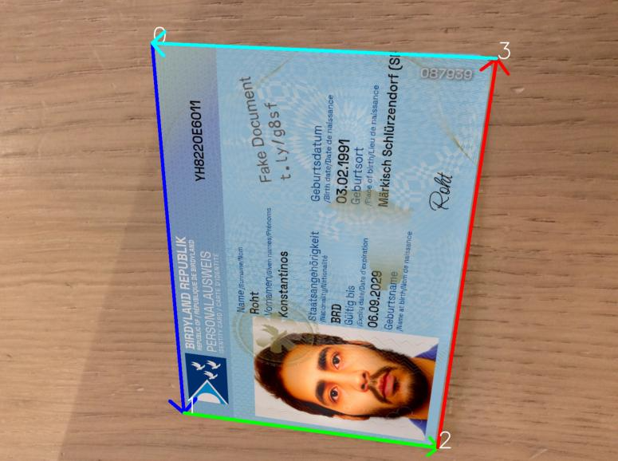
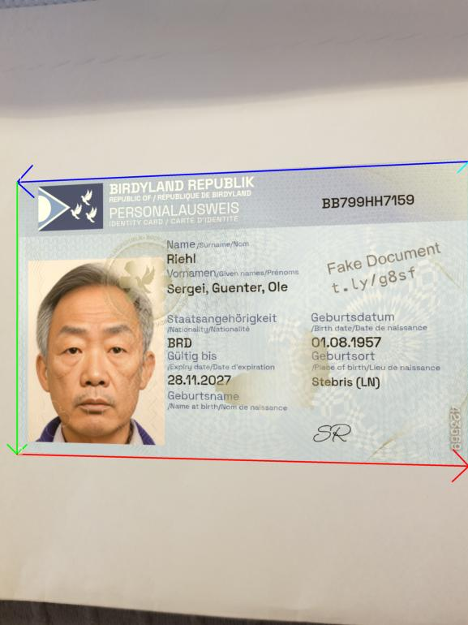
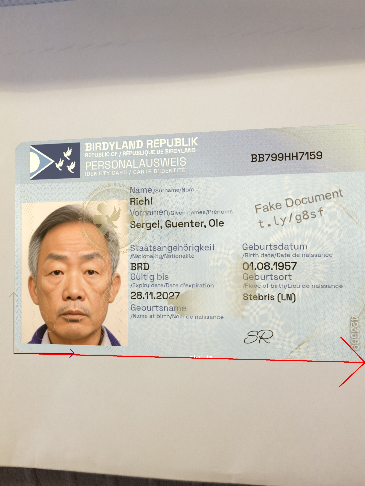
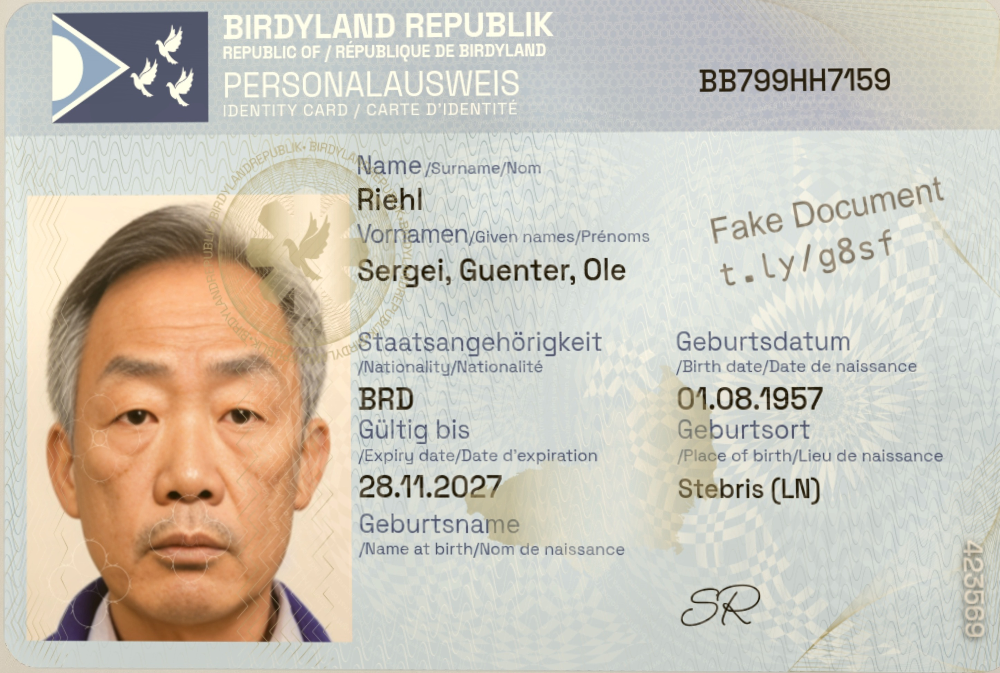
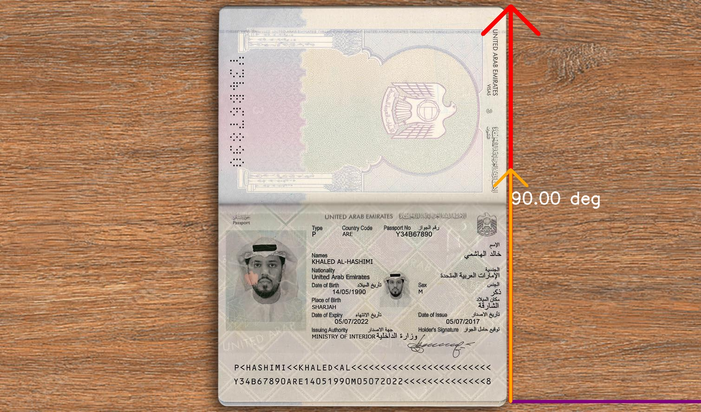
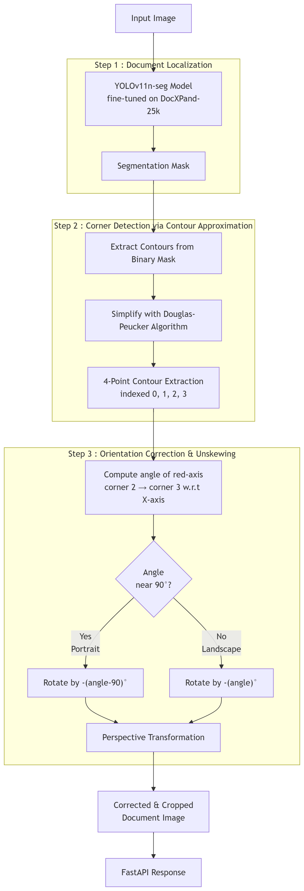

# AI ID-Card Smart Scanner

## Overview

This project is an end-to-end pipeline for automatic **localization, orientation correction, and unskewing of ID card documents** in images. Given a photo of an ID card — which may be rotated at any angle (0–360°) and surrounded by background clutter such as a table surface, hands, or shadows — the system detects the document, crops it precisely, and returns a clean, deskewed output image with consistent padding.

The pipeline consists of three main stages:

1. **Document Localization** — A fine-tuned YOLOv11n segmentation model detects the document region and produces a pixel-level segmentation mask.
2. **Corner Detection** — Contours are extracted from the mask and simplified to identify the four corner points of the document.
3. **Orientation Correction & Unskewing** — The document's tilt angle is calculated from the corner geometry, and a perspective transformation is applied to produce a correctly oriented, rectangular output.

The inference pipeline is also exposed as a **FastAPI** endpoint for easy integration.

---

## Dataset
The model was finetuned on **DocXPand-25k** — a Opensource large-scale synthetic dataset of fake ID document images. It contains **24,994** richly annotated ID card images covering a wide variety of document types.

> [GitHub](https://github.com/QuickSign/docxpand) | [Paper](https://arxiv.org/pdf/2407.20662)

The dataset provides labels for multiple tasks:
- ID classification
- ID localization (document boundary polygon)
- Detection of ID-specific features (face, signature, MRZ)
- ID text field recognition

For this project, only the **localization labels** were used — specifically the 4-point polygon annotation that marks the document boundary in each image. These were converted from the original JSON format into YOLO polygon segmentation format.

**Dataset split used for training:**

| Split      | Images |
|:-----------|-------:|
| Train      | 18,153 |
| Validation |  3,446 |
| Test       |  3,401 |

---

## Steps to run Inference:

### Step-1 : 

cd AI_ID_Card_Smart_Scanner

### Step-2 : Create the virtual environment using poetry using below command 

poetry install

or create virtual environment using conda for python 3.13.5 and run 

pip install -r requirements.txt

### Step-3 : Run inference

python src/inference.py ./sample_input_imgs/test_img_1.jpg

(the output images will be saved in output folder)

### Step-4 : To test FastAPI

#### Start the FastAPI server

uvicorn app:app --reload --port 8001

#### Test by sending request to the API

curl -X POST http://127.0.0.1:8001/process/   -F image=@./sample_input_imgs/test_img_1.jpg

## To Train/Finetune the Yolo11n-seg model :

### Step-1 : 
Use below script to Convert DocXPan_25k Dataset's Localization Labels to YOLO polygon segmentation format
extra_scripts/DocXPand_25k_to_YOLO_Format.ipynb

### Step-2
Training script is provided as .ipynb file i.e., extra_scripts/yolo_polygon_seg_training.ipynb

## Results

### ID Card Segmentation

### Landscape Images

| ordered edges | angle visualization | final scanned image |
|:---:|:---:|:---:|
|  |  |  |
|  |  |  |

### Portrait Images

| ordered edges | angle visualization | final scanned image |
|:---:|:---:|:---:|
|  |  |  |
|  |  |  |

### Diagram

---

> If this project helped you or you found it interesting, consider giving it a ⭐ — it means a lot and helps others discover it!
